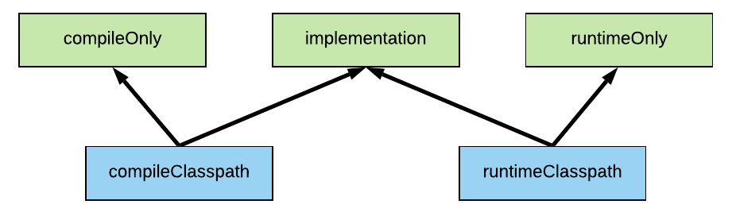
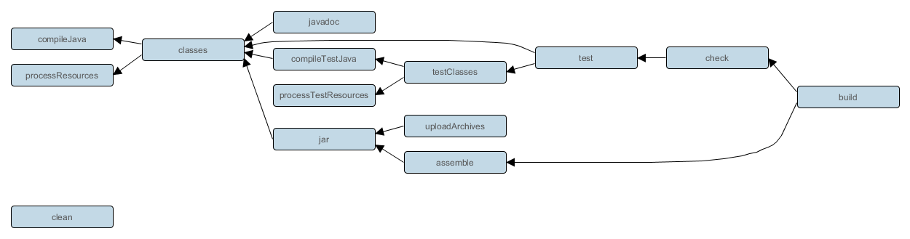

```
sdk install gradle 7.5.1
brew install gradle
gradle init
./gradlew run
./gradlew build
./gradlew -q dependencies --configuration implementation
```

## Concepts
* tasks: inbuilt(init).  
* plugins
* dependency

### tasks
* One task can depend on other task hence Gradle create task graph and run in that order.
* Task consist of input, output and actions.
* Some are inbuilt task like `init`

### Plugins
* plugin can add tasks and dependency configuration.
* plugin can add few other lifecycle tasks.
* plugin can attache some of its task to lifecycle tasks defined by other plugin.
* `base` plugin has tasks
    * clean: Deletes the build directory and everything in it
    * check (lifecycle task): Plugins and build authors should attach their verification tasks, such as ones that run tests, to this lifecycle task using check.dependsOn(task).
    * assemble (lifecycle task): Plugins and build authors should attach tasks that produce distributions and other consumable artifacts to this lifecycle task. For example, jar produces the consumable artifact for Java libraries. Attach using dependsOn(task).
    * build (lifecycle task): Intended to build everything, including running all tests, producing the production artifacts and generating documentation. You will probably rarely attach concrete tasks directly to build as assemble and check are typically more appropriate.
    * buildConfiguration (task rule)
    * cleanTask (task rule)
* `application` plugin tasks. implicitly applies java plugin and distribution plugin.
    * `run` dependsOn `classes`
    * `startScripts` dependsOn `jar`
    * it does not add `Main-Class` to manifest, so jar are not executable. use distribution tar/zip for executable. or add manifest by jar config of java plugin
* `java-library` plugin
* `java` plugin add below tasks and dependencies.
    * dependencies: 
        * `implementation`: Implementation only dependencies. Help accidently use transitive dependency. i.e A->B->C can't use C in A.
        * `compileOnly`: Compile time only dependencies, not used at runtime.
        * `runtimeOnly`: Runtime only dependencies.
        * `testImplementation`: Additional dependencies only for compiling tests, not used at runtime.
        * `testCompileOnly`: Test compile classpath, used when compiling test sources. Used by task compileTestJava.
        * `testRuntimeOnly`: Runtime only dependencies for running tests.
        

    * tasks: 
        * `compileJava`: Compiles production Java source files using the JDK compiler
        * `processResources`
        * `classes`
        * `compileTestJava`: Compiles test Java source files using the JDK compiler.
        * `jar`: dependsOn `classes`. Assembles the production JAR file, based on the classes and resources attached to the main source set.
        * `test`: dependsOn `compileTestJava`. Runs the unit tests using JUnit or TestNG.
        

### Dependency
* Every application depends on some external( contrast std inbuilt) library at some point. Some lib are used only for compiling and testing, while some are needed at runtime. i.e `junit` is test dependency, `protoc` is compile dependency for compilling protobuf file, `kafka-clients` is runtime dependency for kafka consumer producer application.