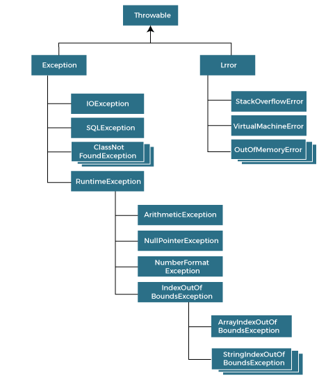

## Syntax
Catching Errors
```
    try {
      callHttpAPI()
     
    } catch(ArithmeticException e){

    } catch (Exception e) {
      
    } finally {
     
    }
```

Throwing Errors
```
if (condition) {
      throw new ArithmeticException("some exception occured");
    }
```

Creating custom Errors
```
public class MyException extends Exception {  
    public MyException(String errorMessage) {  
        super(errorMessage);  
    }  
}  
```
## Error & Exception 


Three type of error
* Checked Exception: these are checked at compile time i.e `IOException`
* Unchecked Exception: these are checked at run time i.e `NullPointerException`.
* Error: not recoverable like `OutOfmemoryError`


## Best Practice
* Prefer most specific exception first
* If you catch exception then do something at least log it or rethrow. If not then it would be extremly difficult to find the error location and cause.
```
try{
    
}catch(Exception e){
    //do nothing, difficult to debug
}
```
* Don't log and rethrow both. If u are throwing then it would be logged at somepoint at upstream.
```
try{

}catch(Exception e){
    log.error(e);
    throw e;
}
```
* Wrap underlying exception with add business context if require
```
try{
    
}catch(Exception e){
	throw new MyBusinessException("some business msg.", e);
}
```