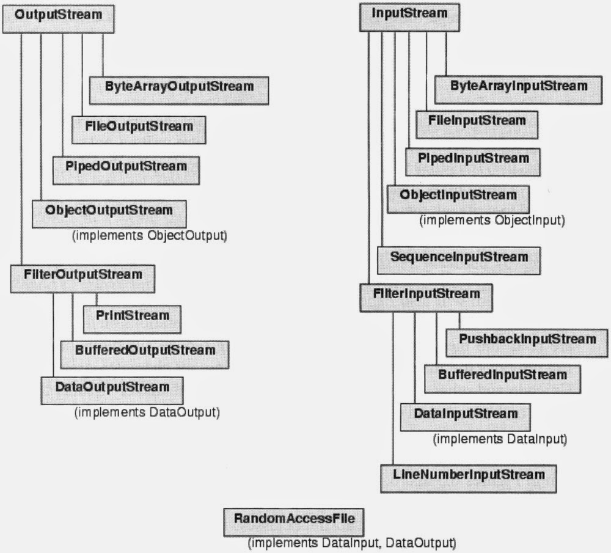

## Rader & Writer
* This is more about character stream. If dealing with text then use this. This should take care of char encoding/decording and


## InputStream & OutputStream
* raw method to read and write resource info. It manipulate at byte level without any kind of translation. Use this for any binary, image data. InputStream can be converted into Reader using `InputStreamReader`.



```
FileReader reader = new FileReader("input.txt");
InputStream inputStream = new FileInputStream("input.txt");

BufferedReader br = new BufferedReader(new InputStreamReader(System.in));
Reader reader = new InputStreamReader(inputStream, StandardCharsets.UTF_8);
```

```
char[] data = new char[100];
FileReader input = new FileReader("input.txt");
input.read(data);
System.out.println("data in file: " + data);
input.close();
```

```
byte[] byteData = new byte[100];
FileReader input = new FileReader("input.txt");
input.read(byteData);
String data = new String(byteData);
System.out.println("data in file: " + data);
input.close();
```