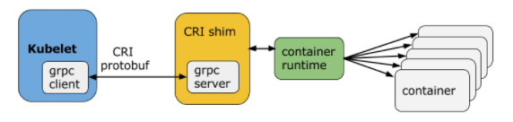

## VM vs Container


## Concepts
* Container runtime/engine: Docker, CRI-O, containerd, podman, lima etc. High level runtime that manage container lifycycle using low level OCI comlaint runtime.
* OCI(open container initiative): linux foundatin work to establish standard for container. OCI complaint runtime runc, crun, runv, etc
* runc: is a CLI tool for running containers on Linux according to the OCI specification
* containerd: 

## docker vs podman
* docker has daemon that take command from docker cli through socket, while podman is daemonless.
* docker container has been mostly run as root while same can run rootless under podman.
* many dev are used to docker-compose which are not well supported by podman. we can use colima for the same if we can't use docker due to license or other reason.


## Podman

```
brew install podman
podman machine init
podman machine start
podman info
```


## OCI

* Established in June 2015 by Docker and other leaders in the container industry, the OCI currently contains three specifications: `runtime-spec`, `image-spec` and `distribution-spec`.
* The Runtime Specification outlines how to run a “filesystem bundle” that is unpacked on disk
* OCI implementation would download OCI image then upack that image into OCI runtime filesystem bundle then it is run by OCI runtime.
* A container runtime is just one component of the cloud native technical architecture but the container runtime itself is out of initial scope of CNCF(cloud native computing foundation). CNCF projects: Kubernetes, Prometheus, Envoy, and CoreDNS 

* he performance of the low-level runtime is only significant during container creation or deletion. Once the process is running, the container runtime is out of the picture.


## Linux and Container

* Container allow set of process to run in its own isolated environment with controllable shared resource quota(i.e cpu, memory).
* Linux already provide set of features that help run container like process, but it is manual. Container related technology help  automate this process.
    * `namespaces`: partition kernel resources such that one set of process see one set of resource while other set of process see different set of resources. It provide isolation. user, pids, network namepaces etc
    * `cgroups`: it help limit, account and isolate resource(cpu, memory etc) use to set of process. This is the core in kubernetes
    * `LSMs(Linux Security Modules)`: 
* cgroup feature was merged into linux kernel around 2008 then lot of project(`LXC`, `systemed-nspawn`, `rkt` etc) came out of it which paved the way for today's container technology.
* Docker started building tool around LXC but later on discontinued it and created `OCI` to set industry standard around containerization.


### Container Runtimes
* OCI(open container initiative) runtimes
    * native
        * runc
        * rkt
    * sandboxed/virtualized: little slower due to extra abstraction layer, run inside lightweight vm.
        * runv
* CRI(container runtime interface)
    * containerd: born at docker in 2014, later on donated to CNCF.
    * cri-o
    * docker-cri-shim: docker itself is not CRI compliant. So k8 uses this shim.
* Container Engine/Toolchain: higher layer software that provide user friendly cli/tool/api that interface with low layer CRI/OCI-runtime to help manage container lifecycle like creating, distributing and running image.
    * docker(containerd + runc): all in one tool to create, distribute and run image in container.
    * podman: image running
    * buildah: image building
    * skopeo: image distribution
    * lima


### Docker alternative
Since docker is one in all tool that provide convenience to user, do we have comparable alernative. Since docker announced a licensed usages for larger business user, some people might looks for its alernative.
* containerd + lima for mac user
* podman + buildah + skopeo
* colima


## QEMU vs KVM
QEMU

* QEMU is a userland type 2 (i.e runs upon a host OS) hypervisor for performing hardware virtualization, such as disk, network etc.
* It is flexible in that it can emulate CPUs via dynamic binary translation (DBT) allowing code written for a given processor to be executed on another (i.e ARM on x86, or PPC on ARM).
* Though QEMU can run on its own and emulate all of the virtual machine’s resources, as all the emulation is performed in software it is extremely slow.
* To overcome software emulation slowness, QEMU allows you to use KVM as an accelerator so that the physical CPU virtualization extensions can be used.
* It works on Linux and Mac.

KVM
* KVM is a Linux kernel module. It is a type 1 hypervisor that is a full virtualization solution for Linux on x86 hardware containing virtualization extensions (Intel VT or AMD-V).
* modern processors support virtualization extensions, such as Intel VT-x and AMD-V. These technologies provide the ability for a slice of the physical CPU to be directly mapped to the vCPU. Therefore the instructions meant for the vCPU can be directly executed on the physical CPU slice


## Container and MacOS
* macos is unix but not linux.
* All these container require linux host, so we require virtualization on macos in order to run linux os.
* HyperKit is an open-source hypervisor for macOS hypervisor, optimized for lightweight virtual machines and container deployment.
* A hypervisor is a type of computer software, firmware or hardware that creates and runs virtual machines. A computer on which a hypervisor runs one or more virtual machines is called a host machine, and each virtual machine is called a guest machine


### colima
* Features
    * Intel and M1 Macs support
    * Simple CLI interface
    * Docker and Containerd support
    * Port Forwarding
    * Volume mounts
    * Kubernetes
* tech
    * uses lima underhood, lima is linux virtual machine(on macos in most case).
    * lima launch vm with auto file sharing and port forwarding simmilar to wsl, it can be considerd as some sort of unofficial containerd for mac.
    * Hypervisor: QEMU with HVF accelerator
    * Filesystem sharing:  Reverse SSHFS
    * Port forwarding: ssh -L, automated by watching /proc/net/tcp and iptables events in the guest
    * Support various linux distro as gues os: ubuntu, Alpine, Debian etc
    * built-in support for containerd and nerdctl(Docker-compatible containerd ctl). Other runtime can also be used.
    * uses k3s for kubernetes
* You can use this as alernative to docker for building image and runing container.
* you can use this as alternative to minikube

```
brew install colima
colima --help
colima start
colima start --help
colima start --edit
colima start --runtime containerd
colima start --kubernetes
colima start --cpu 6 --memory 12 --disk 200 --kubernetes
```

## Container and Kubernetes and Docker
* A Pod is composed of a group of application containers in an isolated environment with resource constraints
* dockershim(containerd) has been removed from k8 1.24, so we need to install CRI compliant runtime like containerd, cri-o etc on each node.
* kubelet(acting as client) communicate with CRI shim (acting as server) over unix socket using grpc framework.



## Docker

### Options
* `-p, --publish`: is way of mapping (at runtime) container port to host port. If no port given then docker will randomly assign some port from host.
* `-P, --publish-all`: Publish all exposed ports to random ports
* `--expose`: 
* `-i`: interactive
* `-t`: tty
* `--mount` or `-v` or `--volume`: mount is more verbose but easier to understand. ordering is important in -v.
```
--mount type=bind,source="$(pwd)"/target,target=/app \
-v "$(pwd)"/target:/app

source=myvol2,target=/app
-v myvol2:/app

type: bind/volume/tmpfs
source/src: host directory/path
target/destination/dst: container directory/path
```
* `-e`: Set environment variables
* `-d`: Run container in background and print container ID
### dockerfile
* `EXPOSE`: way of documenting in Dockerfile that tells which port container is using. It does not open any port on host.
* `FROM`: base image
```
FROM golang:latest #320MB
FROM golang:1.19
FROM golang:1.19-alpine
FROM golang:alpine #120MB
```
* `RUN`: will execute any commands in a new layer on top of the current image and commit the results. The resulting committed image will be used for the next step in the Dockerfile.
```
RUN <command>                           #shell form, command are run in shell.
RUN ["executable", "param1", "param2"]  #exec form

/bin/sh -c                              #default on linux
cmd /S /C                               #default on windows
```

* `CMD`: specifies arguments that will be fed to the ENTRYPOINT.. when container is started this cmd is run. default cmd id `bash`.
* `LABEL`: add metadata to image as key-value pair.
```
LABEL <key>=<value> <key>=<value> <key>=<value> ...
```
* `ENV`: 
```
ENV MY_NAME="John Doe" MY_DOG=Rex\ The\ Dog \
    MY_CAT=fluffy
```
* `ADD`: same as COPY but with added handling for url and tar. ADD will unpack tar. Use COPY wherever possible to avoid getting suprised result.
```
ADD [--chown=<user>:<group>] [--checksum=<checksum>] <src>... <dest>
ADD [--chown=<user>:<group>] ["<src>",... "<dest>"]

ADD hom* /mydir/
```
* `COPY`: same as ADD but without the tar and remote URL handling.
```
COPY hom* /mydir/
```
* `ENTRYPOINT`: specifies a command that will always be executed when the container starts.default entrypoint is `/bin/sh`. all the cmd are run via given entrypoint. Initially it was not an option later on docker added this to provide custom entrypoint.
```
ENTRYPOINT ["executable", "param1", "param2"] #exec form, preffered
ENTRYPOINT command param1 param2 #shell form

docker run -i -t ubuntu bash --> /bin/sh -c bash

docker run redisimg redis -H something -u toto get key # longer cli
ENTRYPOINT ["redis", "-H", "something", "-u", "toto"]
docker run redisimg get key #small cli with proper entrypoint
```
* `VOLUME`: creates a mount point with the specified name and marks it as holding externally mounted volumes from native host or other containers. host directory is declared at container run-time to keep img portablity in mind since host dir is not gauranted.
```
VOLUME ["/data"]
VOLUME /myvol
```
* `USER`: sets the user name (or UID) and optionally the user group (or GID) to use as the default user and group for the remainder of the current stage.
```
RUN net user /add patrick
USER patrick
```
* `WORKDIR`: set the working directory for any furthur instruction in dockerfile.
* `ARGS`: 


### Commands
```
docker image ls
docker container ls
docker network ls
docker volume ls


docker build -f go-server-dockerfile -t simple-go-server .
docker container run -it --rm -p 80:80 ngnix

docker run --rm --name simple-go-server -p 5001:5000 simple-go-server
docker run --name some-postgres -e POSTGRES_PASSWORD=mysecretpassword -d postgres
docker run -itd -e POSTGRES_USER=baeldung -e POSTGRES_PASSWORD=baeldung -p 5432:5432 -v /data:/var/lib/postgresql/data --name postgresql postgres

docker run --name some-nginx -v /some/content:/usr/share/nginx/html:ro -d nginx
docker run --name some-redis -d redis
docker run -d --name elasticsearch --net somenetwork -p 9200:9200 -p 9300:9300 -e "discovery.type=single-node" elasticsearch:tag

```

### volume vs bind mount
* any data written in container's union file system will be lost once container stop running. But generally for statefull container like db data, config etc, we want persistent data.
* bind mount exist on host file system and being managed by host. Process outside docker can also modify it. Good for live reloading, config editing directly from host without going into contaienr. limited functionality compare to volume
* volume can also be implemented on host but docker will manage them for us and they can not be accessed outside docker. This reside under $docker-data-dir/volumes which is /var/lib/docker.
* volume can be created independently or while during container creation. Given volume can be mounted into multiple container. 
* volume bind is simillar to bind mount except volume is managed by docker & isolated from core functinality of host machine.
* type: `bind`, `volume`, `tmpfs`