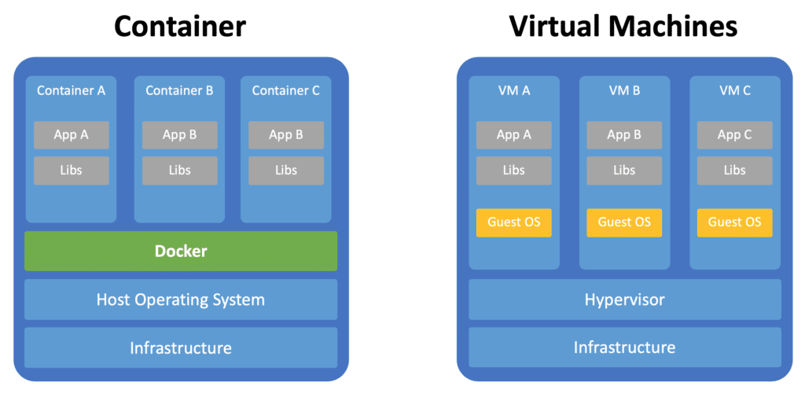
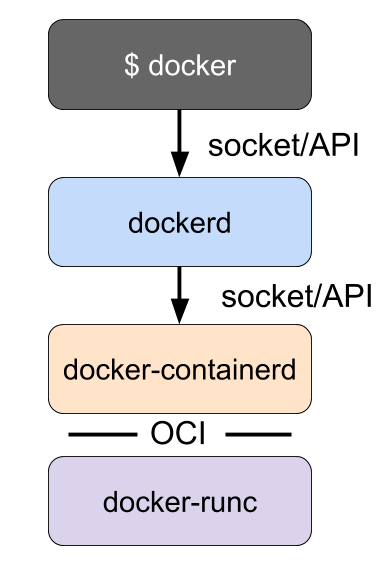
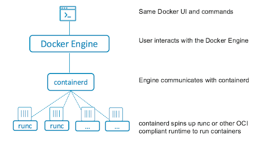
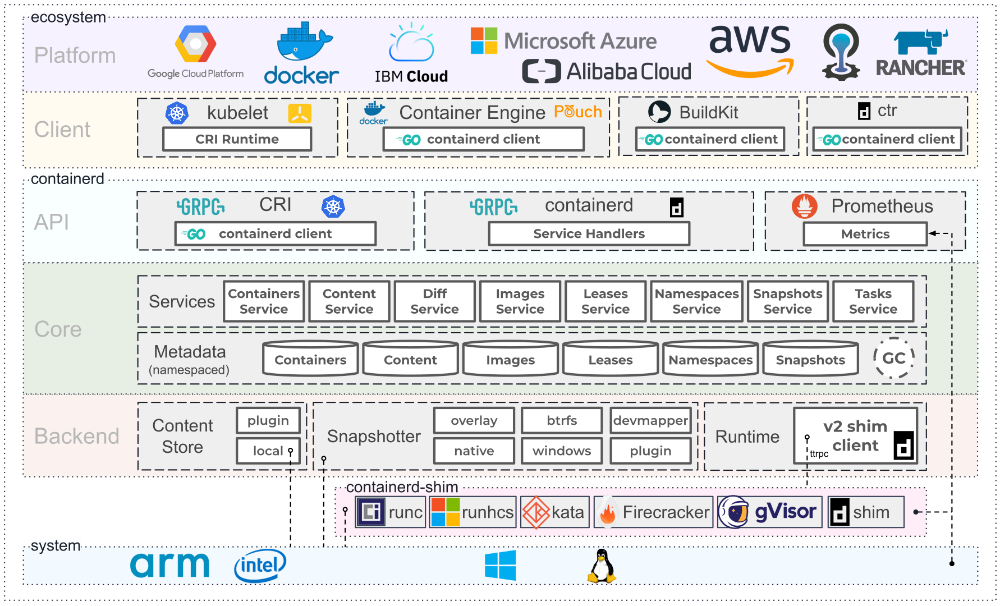
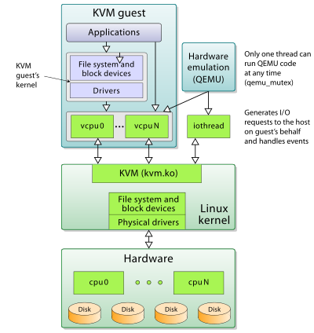

## VM vs Container



## Concepts
* Container runtime/engine: Docker, CRI-O, containerd, podman, lima etc. High level runtime that manage container lifycycle using low level OCI comlaint runtime.
* OCI(open container initiative): linux foundatin work to establish standard for container. OCI complaint runtime runc, crun, runv, etc
* runc: is a CLI tool for running containers on Linux according to the OCI specification
* containerd: 

## docker vs podman
* docker has daemon that take command from docker cli through socket, while podman is daemonless.
* docker container has been mostly run as root while same can run rootless under podman.
* many dev are used to docker-compose which are not well supported by podman. we can use colima for the same if we can't use docker due to license or other reason.



## Podman

```
brew install podman
podman machine init
podman machine start
podman info
```


## OCI

* Established in June 2015 by Docker and other leaders in the container industry, the OCI currently contains three specifications: `runtime-spec`, `image-spec` and `distribution-spec`.
* The Runtime Specification outlines how to run a “filesystem bundle” that is unpacked on disk
* OCI implementation would download OCI image then upack that image into OCI runtime filesystem bundle then it is run by OCI runtime.
* A container runtime is just one component of the cloud native technical architecture but the container runtime itself is out of initial scope of CNCF(cloud native computing foundation). CNCF projects: Kubernetes, Prometheus, Envoy, and CoreDNS 

* he performance of the low-level runtime is only significant during container creation or deletion. Once the process is running, the container runtime is out of the picture.


## Linux and Container

* Container allow set of process to run in its own isolated environment with controllable shared resource quota(i.e cpu, memory).
* Linux already provide set of features that help run container like process, but it is manual. Container related technology help  automate this process.
    * `namespaces`: partition kernel resources such that one set of process see one set of resource while other set of process see different set of resources. It provide isolation. user, pids, network namepaces etc
    * `cgroups`: it help limit, account and isolate resource(cpu, memory etc) use to set of process. This is the core in kubernetes
    * `LSMs(Linux Security Modules)`: 
* cgroup feature was merged into linux kernel around 2008 then lot of project(`LXC`, `systemed-nspawn`, `rkt` etc) came out of it which paved the way for today's container technology.
* Docker started building tool around LXC but later on discontinued it and created `OCI` to set industry standard around containerization.


### Container Runtimes
* OCI(open container initiative) runtimes
    * native
        * runc
        * rkt
    * sandboxed/virtualized: little slower due to extra abstraction layer, run inside lightweight vm.
        * runv
* CRI(container runtime interface)
    * containerd: born at docker in 2014, later on donated to CNCF.
    * cri-o
    * docker-cri-shim: docker itself is not CRI compliant. So k8 uses this shim.
* Container Engine/Toolchain: higher layer software that provide user friendly cli/tool/api that interface with low layer CRI/OCI-runtime to help manage container lifecycle like creating, distributing and running image.
    * docker(containerd + runc): all in one tool to create, distribute and run image in container.
    * podman: image running
    * buildah: image building
    * skopeo: image distribution
    * lima



### Docker alternative
Since docker is one in all tool that provide convenience to user, do we have comparable alernative. Since docker announced a licensed usages for larger business user, some people might looks for its alernative.
* containerd + lima for mac user
* podman + buildah + skopeo
* colima


## QEMU vs KVM
QEMU

* QEMU is a userland type 2 (i.e runs upon a host OS) hypervisor for performing hardware virtualization, such as disk, network etc.
* It is flexible in that it can emulate CPUs via dynamic binary translation (DBT) allowing code written for a given processor to be executed on another (i.e ARM on x86, or PPC on ARM).
* Though QEMU can run on its own and emulate all of the virtual machine’s resources, as all the emulation is performed in software it is extremely slow.
* To overcome software emulation slowness, QEMU allows you to use KVM as an accelerator so that the physical CPU virtualization extensions can be used.
* It works on Linux and Mac.

KVM
* KVM is a Linux kernel module. It is a type 1 hypervisor that is a full virtualization solution for Linux on x86 hardware containing virtualization extensions (Intel VT or AMD-V).
* modern processors support virtualization extensions, such as Intel VT-x and AMD-V. These technologies provide the ability for a slice of the physical CPU to be directly mapped to the vCPU. Therefore the instructions meant for the vCPU can be directly executed on the physical CPU slice


## Container and MacOS
* macos is unix but not linux.
* All these container require linux host, so we require virtualization on macos in order to run linux os.
* HyperKit is an open-source hypervisor for macOS hypervisor, optimized for lightweight virtual machines and container deployment.
* A hypervisor is a type of computer software, firmware or hardware that creates and runs virtual machines. A computer on which a hypervisor runs one or more virtual machines is called a host machine, and each virtual machine is called a guest machine


### colima
* Features
    * Intel and M1 Macs support
    * Simple CLI interface
    * Docker and Containerd support
    * Port Forwarding
    * Volume mounts
    * Kubernetes
* tech
    * uses lima underhood, lima is linux virtual machine(on macos in most case).
    * lima launch vm with auto file sharing and port forwarding simmilar to wsl, it can be considerd as some sort of unofficial containerd for mac.
    * Hypervisor: QEMU with HVF accelerator
    * Filesystem sharing:  Reverse SSHFS
    * Port forwarding: ssh -L, automated by watching /proc/net/tcp and iptables events in the guest
    * Support various linux distro as gues os: ubuntu, Alpine, Debian etc
* You can use this as alernative to docker for building image and runing container.
* you can use this as alternative to minikube

```
brew install colima
colima --help
colima start
colima start --help
colima start --edit
colima start --runtime containerd
colima start --kubernetes
colima start --cpu 6 --memory 12 --disk 200 --with-kubernetes
```

## Container and Kubernetes and Docker
* 