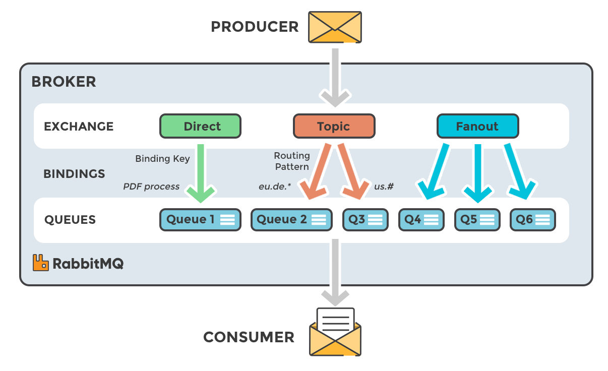

usecase
* Queue: 
* Defer resource heavy task later
* want to distribute work among multiple worker
* schedule a job

Concepts
* Producer: Application that sends the messages
* consumer: Application that receives the messages.
* Queues: Data structure that store the messages
* Message: Information that is sent from the producer to a consumer through RabbitMQ
* Connection: A TCP connection between your application and the RabbitMQ broker.
* Channel: A virtual connection inside a connection. When publishing or consuming messages from a queue - it's all done over a channel.
* Exchange: Receives messages from producers and pushes them to queues depending on rules(`headerAttribute`, `binding`, `routingKey`) defined by the exchange type. To receive messages, a queue needs to be bound to at least one exchange.
    * Direct: uses msg's routingKey & exchange's bindingKey to route to Queue
    * Fanout: route msg to all the queue bound to that exchange
    * Topic: wildcard match b/w msg's routingKey and exchange's binding routingPattern
    * Headers: uses header attribute for routing.
* Binding: A binding is a link between a queue and an exchange.
* Routing key: A key that the exchange looks at to decide how to route the message to queues. Think of the routing key like an address for the message. The routing key is a message attribute added to the message header by the producer
* Protocol: msg protocol
    * AMQP: Advanced Binary Message Queuing Protocol is the protocol used by RabbitMQ for messaging. `AMQP 1.0` is radically different & more complex protocol than `AMQP 0-9-1`
    * MQTT: Binary protocol emphasising lightweight publish / subscribe messaging, targeted towards clients in constrained devices
    * STOMP: text-based messaging protocol emphasising (protocol) simplicity.
* Consumer Acknowledgements: rmq uses consumer's `ack` as confirmation to delete msg i.e once msg is consumed by consumer then he has give ack.
* Automatic Acknowledgements: in this `auto` mode, rmq delete the msg soon after sending. Increase throughput & performance but on cost of missed msg by consumer.
* Negative Acknowledgements: if consumer give `nack` then reque the msg to be consumed later again.
* Publisher Acknowledgements: to confirm if msg has reached to broker, rmq send ack to producer.
* Dead Letter Routing: it uses dead letter fro below scenario.
    * The message is negatively acknowledged by a consumer and is not re-queued by the RabbitMQ broker.
    * The message expires after it exceeds the time to live period.
    * The message was dropped because its queue exceeded a length limit.

msg don't directly go to queue. It first goes to exchange & it is responsible for routing the msg to different queue based on binding and routing key.

## management portal
* default port: `15672`
* default usr/pwd: `guest/guest`