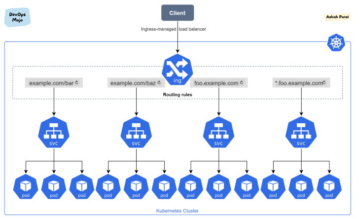
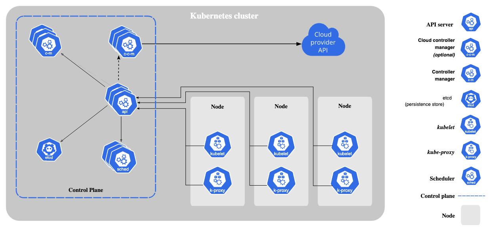

## Workload Resources/Objects
* `kubectl api-resources` return the list of supported object
* types
  * Deployment
  * Pod
  * Node
  * Service
  * Ingress
  * ..etc

## service
* it is used to expose the service
* type
    * clusterIP: reachable within the cluster
    * NodePort: extension of clusterIP. reachable from outside cluster and external traffic
    * LoadBalancer: extension of Nodeport. expose service externaly using cloud own(aws, gcp) load balancer
    * ExternalName


### nodeport
* `port`: is used when one service wants to talk to other service.
* `nodePort`: is used when someone wants to talk to service outside cluster. Control plane will auto assign port from available ports(default: 30000-32767). We can assign manually but it might lead to collision if same port is already allocated. traffic--->nodePort-->port-->targetPort
* `targetPort`: it is actual port that service is listening on inside container.
```
apiVersion: v1
kind: Service
metadata:
  name: my-service
spec:
  type: NodePort
  selector:
    app.kubernetes.io/name: MyApp
  ports:
    - port: 80
      targetPort: 80
      nodePort: 30007
```

## Ingress
* ingress can also be used to expose service under same ip address using different name. mainly used for http service.
* it does not expose arbitrary ports or protocol. To expose services than http/https(i.e may be grpc), we require servcie `NodePort` or `LoadBalancer`.

Ingress controller: 
* it can be software load balancer or hardware or cloud load balancer running externally.
* examples: Nginx, Ambassador, EnRoute, HAProxy, AWS ALB, AKS Application Gateway



## commands

* `kubectl create` is imperative while `kubectl apply` is declarative pattern. apply will not throw error if resource is already created.
```
kubectl get pods
kubectl get nodes
kubectl get deployments
kubectl get services
kubectl get ingress
kubectl get pod my-pod -o yaml
kubectl get pod my-pod -o wide
kubectl get pods mypod -o jsonpath='{.spec.containers[*].name}'

kubectl get events
kubectl config view
kubectl config get-clusters
kubectl config get-contexts
kubectl config use-context CONTEXT_NAME

kubectl delete pod nginx
kubectl scale deployment hello-node --replicas 2

kubectl describe nodes node1
kubectl describe pods pod1
kubectl describe deployments deployment1
kubectl describe services service1
kubectl describe ingress ingres1

kubectls top nodes  # return node's cpu & mem usages(%, exact)
kubectls top pod    # return pod's exact cpu & mem usages
kubectl top pod | grep "podRegx1\|podRegx2"

kubectl logs my-pod -c my-container
kubectl exec -it mypod bash -c mycontainer

kubectl create deployment hello-node --image=registry.k8s.io/echoserver:1.4
kubectl apply -f ./nginx-deployment.yaml # yaml file can be web url
kubectl expose deployment hello-node --type=LoadBalancer --port=8080 # expose this port app is listening on

kubectl cluster-info
```

## helm & chart
* [how to use helm3 to install software on k8](https://www.digitalocean.com/community/tutorials/how-to-install-software-on-kubernetes-clusters-with-the-helm-3-package-manager)
* chart bootstrap resource i.e telegraf deployment on k8 cluster using helm pkg manager

```
#example-chart i.e ngnix
charts/
templates/
├─ tests/
│  ├─ test-connection.yaml
├─ deployment.yaml
├─ hpa.yaml
├─ ingress.yaml
├─ NOTES.txt
├─ service.yaml
├─ serviceaccount.yaml
├─ _helpers.tpl
Chart.yaml
values.yaml
```

```
#cat example-chart/templates/service.yaml
apiVersion: v1
kind: Service
metadata:
  name: {{ include "mychart.fullname" . }}
  labels:
    {{- include "mychart.labels" . | nindent 4 }}
spec:
  type: {{ .Values.service.type }}
  ports:
    - port: {{ .Values.service.port }}
      targetPort: http
      protocol: TCP
      name: http
  selector:
    {{- include "mychart.selectorLabels" . | nindent 4 }}
```

```
helm install ingress-nginx/ingress-nginx --set variable_name=variable_value
helm list
helm upgrade ingress-nginx ingress-nginx/ingress-nginx --set controller.replicaCount=3 --reuse-values

helm install example-chart --dry-run --debug ./example-chart
helm package ./example-chart
helm install example-chart example-chart-0.1.0.tgz
```

## Getting started

* tool
  * `Minikube`: very simple, minimal. single node cluster. no way to add other node.
  * `Kubeadm`: can add 1 master, N worker node. Require powerfull laptop.
  * `kind`: It support all sort of cluster. N master, N worker. require docker. complicated external networking.
  * `k3s`: lightweight version of kubernetes. some feature missing. uses sqlite as db compare to etcd/postgres in k8
  * `k9s`:
  * `rancher`: 


## Kubernetes Metrics
* 4 golden rule: `latency`, `traffic`, `errors`, `saturation`(underlying cpu, mem etc)
* `node_exporter` a prometheus client sends 1000s of metric at node level.
* `cAdvisor` embeded in kubelet, provide metric at container level
* `limit` and `request` are set at container level. If cpu exceed limit then its throttled. If memory exceed limit then it is killed. 

### node cpu utilization: 
*  `node_cpu` is counter, so rate is needed.
* `node_load1` is gauge, 1 minute avg load. Need cpu core in order to make sense.
* we can derive count of cpu: `count(node_cpu{mode="system"}) by (node)`

```
sum(node_load1) by (node) / count(node_cpu{mode="system"}) by (node) * 100
```
```
sum(rate(
         node_cpu{mode!=”idle”,
                  mode!=”iowait”,
                  mode!~”^(?:guest.*)$”
                  }[5m])) BY (instance)
```

### node memory utilization
* Apart from `free`, `buffer` and `cached` are also free memory. So 
```
sum(node_memory_MemFree + node_memory_Cached + node_memory_Buffers)
```
* Newer linux kernel reporter better free memory metric: `node_memory_MemAvailable`
```
1 - sum(node_memory_MemAvailable) by (node) 
/ sum(node_memory_MemTotal) by (node)
```

### node disk utilization
* `node_disk_io_now`, `node_disk_io_time_ms`, `node_disk_io_weighted` 
```
sum(node_filesystem_free{mountpoint="/"}) by (node, mountpoint) / sum(node_filesystem_size{mountpoint="/"}) by (node, mountpoint)
```

### node network utilization
```
sum(rate(node_network_receive_bytes[5m])) by (node) + sum(rate(node_network_transmit_bytes[5m])) by (node)
```

```
sum(rate(node_network_receive_drop[5m])) by (node) + sum(rate(node_network_transmit_drop[5m])) by (node)
```

### container cpu utilization
* `container_cpu_user_seconds_total`: total user time
* `container_cpu_system_seconds_total`: total system time
* `container_cpu_usage_seconds_total`: sum of above
* all above are counter, so apply rate.
```
sum(
    rate(container_cpu_usage_seconds_total[5m]))
by (container_name)
```

```
sum(container_memory_working_set_bytes) by (container_name) / sum(label_join(kube_pod_container_resource_limits_memory_bytes,
    "container_name", "", "container")) by (container_name)
```

## Minikube
* container runtime is prerequiste like docker, podman, hyperkit etc
* On cloud providers that support load balancers, an external IP address would be provisioned to access the Service. On minikube, the LoadBalancer type makes the Service accessible through the minikube service command.
```
brew install minikube
minikube start --driver=docker

kubectl create deployment hello-node --image=registry.k8s.io/echoserver:1.4
kubectl expose deployment hello-node --type=LoadBalancer --port=8080
minikube service hello-node

minikube addons list
minikube addons enable metrics-server
minikube addons disable metrics-server

kubectl delete service hello-node
kubectl delete deployment hello-node
minikube stop
minikube delete # delete vm, avoid this unless needed again.

minikube config set cpu <whatever>
minikube config set memory <whatever>
```

## Kind
* docker is prerequisite
```
brew install kind
kind create cluster #default one
kind create cluster --name kind-2
kind get clusters
```

## Helm


## Storage


## Network

## kubernetes components


* Control plane components
    * kube-apiserver
    * ectc
    * kube-scheduler
    * kube-controller-manager
    * cloud-controller-manager
* Node components
    * kubelet: agent that run on each node in cluster. it make sure containers are running inpod.
    * kube-proxy: network proxy that run on each node in cluster,  implementing part of the Kubernetes Service concept.. Maintain network rules that allow comms to pods from inside & outside cluster.
    * container runtime: responsible for running container. it supports runtime such as containered, CRI-O, other impl of CRI


## Kubernetes GCP
Single zone clusters
* master and nodes both run in only one zone
* if cluster name does have zone suffix then it is zonal cluster. i.e `asia-east1-a`, `asia-east1-b`
* if zone outage then service outage

Multi zonal clusters
* master run  in only one zone
* nodes distributed among multiple zone.
* if cluster name does have zone suffix then it is zonal cluster. i.e `asia-east1-a`, `asia-east1-b`
* if master zone outage, service will still be working though won't be able to configure until master is up

Regional clusters
* master distributed among multiple zone
* nodes distrubuted among multiple zone
* if cluster name does not have zone suffix then it is reginal cluster. i.e `asia-east1`
* default no of zone: 3
* default no of nodes per zone: 3
* default no of masters: 3

## Kubernetes AWS