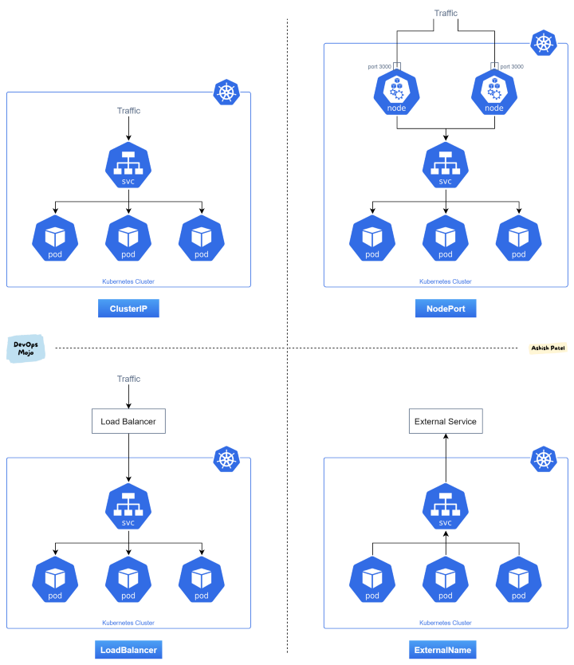

## service
* it is used to expose the service
* type
    * clusterIP: reachable within the cluster
    * NodePort: extension of clusterIP. reachable from outside cluster and external traffic
    * LoadBalancer: extension of Nodeport. expose service externaly using cloud own(aws, gcp) load balancer
    * ExternalName


## Ingress
* ingress can also be used to expose service under same ip address using different name. mainly used for http service.
* it does not expose arbitrary ports or protocol. To expose services than http/https(i.e may be grpc), we require servcie `NodePort` or `LoadBalancer`.

Ingress controller: 
* it can be software load balancer or hardware or cloud load balancer running externally.
* examples: Nginx, Ambassador, EnRoute, HAProxy, AWS ALB, AKS Application Gateway


## commands
```
kubectl get pods
kubectl get nodes
kubectl get deployments
kubectl get services
kubectl get ingress
kubectl get pod my-pod -o yaml
kubectl get pod my-pod -o wide
kubectl get pods mypod -o jsonpath='{.spec.containers[*].name}'


kubectl describe nodes node1
kubectl describe pods pod1
kubectl describe deployments deployment1
kubectl describe services service1
kubectl describe ingress ingres1

kubectls top nodes  # return node's cpu & mem usages(%, exact)
kubectls top pod    # return pod's exact cpu & mem usages
kubectl top pod | grep "podRegx1\|podRegx2"

kubectl logs my-pod -c my-container
kubectl exec -it mypod bash -c mycontainer
```

## helm & chart
* [how to use helm3 to install software on k8](https://www.digitalocean.com/community/tutorials/how-to-install-software-on-kubernetes-clusters-with-the-helm-3-package-manager)
* chart bootstrap resource i.e telegraf deployment on k8 cluster using helm pkg manager

```
#example-chart i.e ngnix
charts/
templates/
├─ tests/
│  ├─ test-connection.yaml
├─ deployment.yaml
├─ hpa.yaml
├─ ingress.yaml
├─ NOTES.txt
├─ service.yaml
├─ serviceaccount.yaml
├─ _helpers.tpl
Chart.yaml
values.yaml
```

```
#cat example-chart/templates/service.yaml
apiVersion: v1
kind: Service
metadata:
  name: {{ include "mychart.fullname" . }}
  labels:
    {{- include "mychart.labels" . | nindent 4 }}
spec:
  type: {{ .Values.service.type }}
  ports:
    - port: {{ .Values.service.port }}
      targetPort: http
      protocol: TCP
      name: http
  selector:
    {{- include "mychart.selectorLabels" . | nindent 4 }}
```

```
helm install ingress-nginx/ingress-nginx --set variable_name=variable_value
helm list
helm upgrade ingress-nginx ingress-nginx/ingress-nginx --set controller.replicaCount=3 --reuse-values

helm install example-chart --dry-run --debug ./example-chart
helm package ./example-chart
helm install example-chart example-chart-0.1.0.tgz
```

## Getting started

* tool
  * `Minikube`: very simple, minimal. single node cluster. no way to add other node.
  * `Kubeadm`: can add 1 master, N worker node. Require powerfull laptop.
  * `kind`: It support all sort of cluster. N master, N worker. require docker. complicated external networking.
  * `k3s`: lightweight version of kubernetes. some feature missing.


## Kubernetes Metrics
* 4 golden rule: `latency`, `traffic`, `errors`, `saturation`(underlying cpu, mem etc)
* `node_exporter` a prometheus client sends 1000s of metric at node level.
* `cAdvisor` embeded in kubelet, provide metric at container level
* `limit` and `request` are set at container level. If cpu exceed limit then its throttled. If memory exceed limit then it is killed. 

### node cpu utilization: 
*  `node_cpu` is counter, so rate is needed.
* `node_load1` is gauge, 1 minute avg load. Need cpu core in order to make sense.
* we can derive count of cpu: `count(node_cpu{mode="system"}) by (node)`

```
sum(node_load1) by (node) / count(node_cpu{mode="system"}) by (node) * 100
```
```
sum(rate(
         node_cpu{mode!=”idle”,
                  mode!=”iowait”,
                  mode!~”^(?:guest.*)$”
                  }[5m])) BY (instance)
```

### node memory utilization
* Apart from `free`, `buffer` and `cached` are also free memory. So 
```
sum(node_memory_MemFree + node_memory_Cached + node_memory_Buffers)
```
* Newer linux kernel reporter better free memory metric: `node_memory_MemAvailable`
```
1 - sum(node_memory_MemAvailable) by (node) 
/ sum(node_memory_MemTotal) by (node)
```

### node disk utilization
* `node_disk_io_now`, `node_disk_io_time_ms`, `node_disk_io_weighted` 
```
sum(node_filesystem_free{mountpoint="/"}) by (node, mountpoint) / sum(node_filesystem_size{mountpoint="/"}) by (node, mountpoint)
```

### node network utilization
```
sum(rate(node_network_receive_bytes[5m])) by (node) + sum(rate(node_network_transmit_bytes[5m])) by (node)
```

```
sum(rate(node_network_receive_drop[5m])) by (node) + sum(rate(node_network_transmit_drop[5m])) by (node)
```

### container cpu utilization
* `container_cpu_user_seconds_total`: total user time
* `container_cpu_system_seconds_total`: total system time
* `container_cpu_usage_seconds_total`: sum of above
* all above are counter, so apply rate.
```
sum(
    rate(container_cpu_usage_seconds_total[5m]))
by (container_name)
```

```
sum(container_memory_working_set_bytes) by (container_name) / sum(label_join(kube_pod_container_resource_limits_memory_bytes,
    "container_name", "", "container")) by (container_name)
```