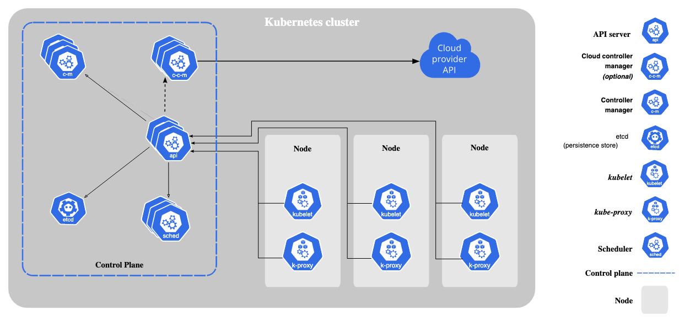

* compute engine resources are hosted in multiple location worldwide.
* locations are composed of regions and zone.
* each reason has one or more zone. most region has three or more zone.
``` 
use-west1: use-west1-a, use-west1-b, use-west1-c
```

Single zone clusters
* master and nodes both run in only one zone
* if cluster name does have zone suffix then it is zonal cluster. i.e `asia-east1-a`, `asia-east1-b`
* if zone outage then service outage

Multi zonal clusters
* master run  in only one zone
* nodes distributed among multiple zone.
* if cluster name does have zone suffix then it is zonal cluster. i.e `asia-east1-a`, `asia-east1-b`
* if master zone outage, service will still be working though won't be able to configure until master is up

Regional clusters
* master distributed among multiple zone
* nodes distrubuted among multiple zone
* if cluster name does not have zone suffix then it is reginal cluster. i.e `asia-east1`
* default no of zone: 3
* default no of nodes per zone: 3
* default no of masters: 3

kubernetes components


* Control plane components
    * kube-apiserver
    * ectc
    * kube-scheduler
    * kube-controller-manager
    * cloud-controller-manager
* Node components
    * kubelet: agent that run on each node in cluster. it make sure containers are running inpod.
    * kube-proxy: network proxy that run on each node in cluster. Maintain network rules that allow comms to pods from inside & outside cluster.
    * container runtime: responsible for running container. it supports runtime such as containered, CRI-O, other impl of CRI