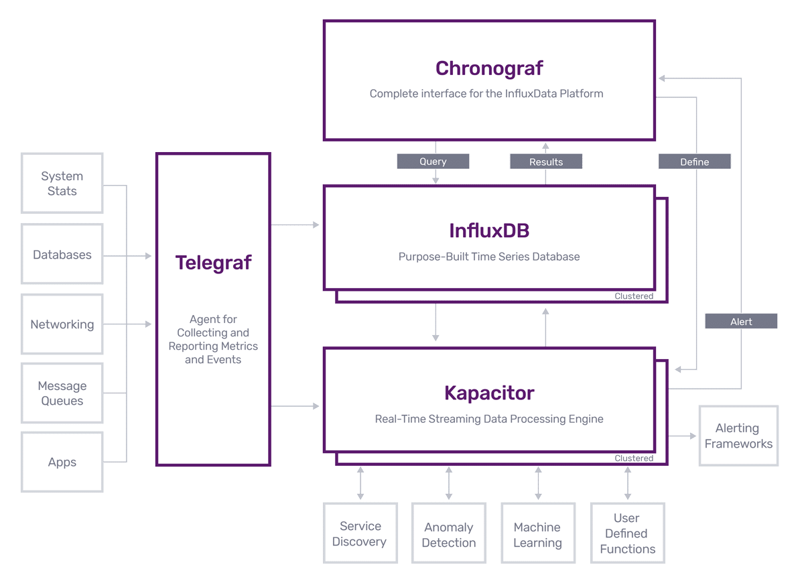
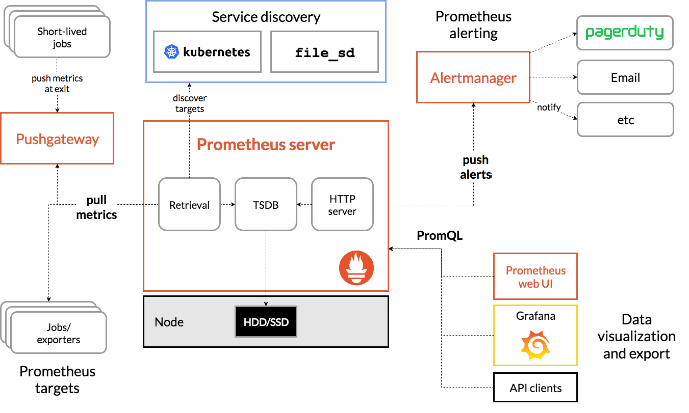

load
* load1: avg no of process waiting in last 1 min
* load5
* load15

```
23:16:49 up  10:49,  5 user,  load average: 1.00, 0.40, 3.35

ON 1cpu core: 
    cpu was 100% utilized. 1 process were running on cpu over last 1 minute.
    cpu was idle 60% on averge. no process were waiting for cpu over last 5 minute.
    cpu was overloaded by 235% on average. 2.35 processes were waiting over last 15m
ON 2cpu core: 
    1cpu 100% idle. no cpu were waiting for cpu time over last 1min
    idle 60% on avg. no process wait for cpu time over last 5m
    overload by 135% on avg. 1.35 process wait for cpu time over last 15m
```
usages: cpu time being used by various process
* system: kernel/system space program.
* user: user space code like app. take most of the time
* nice: subset of user state. process with low priority.
* idle: doing nothing
* iowait: waiting for disk read/write. if spike problem outside cpu


## disk
* sda, sda1, sda2
* linux auto assign the number to hard disk. these are block device other are char
* if single hard disk contain partion then those partition will also be assigned. one disk have max 15 part

```
$ sudo fdisk -l
Disk /dev/sda: 465.76 GiB, 500107862016 bytes, 976773168 sectors
Device     Boot     Start       End   Sectors   Size Id Type
/dev/sda1  *         2048    104447    102400    50M  7 HPFS/NTFS/exFAT
/dev/sda2          104448 484152681 484048234 230.8G  7 HPFS/NTFS/exFAT
/dev/sda3       484155392 485249023   1093632   534M 27 Hidden NTFS WinRE
/dev/sda4       485251070 976771071 491520002 234.4G  5 Extended
/dev/sda5       485251072 974772223 489521152 233.4G 83 Linux
/dev/sda6       974774272 976771071   1996800   975M 82 Linux swap / Solaris

$ lsblk
NAME   MAJ:MIN RM   SIZE RO TYPE MOUNTPOINTS
sda      8:0    0 465.8G  0 disk 
├─sda1   8:1    0    50M  0 part 
├─sda2   8:2    0 230.8G  0 part 
├─sda3   8:3    0   534M  0 part 
├─sda4   8:4    0     1K  0 part 
├─sda5   8:5    0 233.4G  0 part /
└─sda6   8:6    0   975M  0 part [SWAP]
sr0     11:0    1  1024M  0 rom 
```

disk io request per sec
* diskio_reads 
* diskio_writes 

* diskio_write_bytes 
* diskio_read_bytes

* diskio_io_time(percent io util): 
* diskio_weighted_io_time(avg que depth): here
    * The disk queue length reports on the number of outstanding operations to a particular volume
    * A good rule of thumb is that there should never be more than half the number of spindles in the queue length. If you have a 10-disk RAID volume, the queue length should be less than 5

* diskio_read_time
* diskio_write_time
* disk_total/disk_used/disk_used_percent


a portion of the filesystem is dedicated to inodes. An inode is a data structure that describes a file or a folder.It includes things like the owner, the group, permissions, file size, created etc. To check how many inodes are in use and free, use df -i
* disk_inodes_free
* disk_inodes_used

## memory
usages: 
* total: Your total (physical) RAM (excluding a small bit that the kernel permanently reserves for itself at startup); that's why it shows ca. 11.7 GiB , and not 12 GiB, which you probably have.
* used: memory in use by the OS
* available: total - used
* free: memory not in use.
* shared, buffered, cache: This shows memory usage for specific purposes, these values are included in the value for used

## network

## tuples and vacuum
* autovacuum avoid tabel growwing unnecessarily. If a table does not have autovacuum running, it will have to keep growing to store new data somewhere because if data is being deleted then it can not be reused unless autovacuum runs.
* autovacuum running frequent is good thing unless it take itself long time
* dead row/tupple: on delete mark the row as dead, on update: insert new row & mark old row as dead
* live row/tupple: current version of rows that are avilable for txn/query


## golang
* goroutines count: On a machine with 4 GB of memory installed, this limits the maximum number of goroutines to slightly less than 1 million.
* GC Pause time in ms: stop the world. happens when a region of memory is full and the JVM requires space to continue
* GC Pause frequency: calls per minute
* GC Pauses as % of wall-clock time
* cpu % utilization(ueser & system)
* memory allocation


## newrelic
web vs non-web txn
* When you instrument or wrap a transaction that has an HTTP request and response writer, New Relic treats it as a web transaction.
* When you instrument or wrap a transaction that does not have HTTP data, New Relic treats it as a non-web transaction.
golang: monitor txn: [here](https://docs.newrelic.com/docs/apm/agents/go-agent/instrumentation/instrument-go-transactions/)
```
txn := app.StartTransaction("transaction_name")
defer txn.End()

To monitor a web transaction, call the Transaction.SetWebRequest and optionally the Transaction.SetWebResponse APIs:
// req is a *http.Request, this marks the transaction as a web transaction
txn.SetWebRequestHTTP(req)

// writer is a http.ResponseWriter, use the returned writer in place of the original
writer = txn.SetWebResponse(writer)
writer.WriteHeader(500)
```

## monitoring and alerting
* components
    * Data Ingestion: `Logstash`, `telegraf`, `grafana agent`
    * Data Storage: `influx DB`, `prometheous`, `Elasticsearch`
    * Visualization: `grafana`, `Chronograf`, `Prometheus web ui`, `Kibana`
    * Alerting: `Kapacitor`, 
    * clients: `statsd client`, `prometheus client`
* stacks
    * TICK: `Telegraf` + `InfluxDB` + `Chronograf` + `Kapacitor`
    * ELK:  `Elasticsearch` + `Logstash` + `Kibana`
    * grafana/Loki/prom: 
* `StatsD` is simple proctocol for sending application metrics over UDP.
* various alert manager has integration with channel like `slack`, `pagerDuty` etc
* `grafana agent` can be run as sidecar to scrape metric from app at x interval and forward to grafana.

TICK Stack


Prmoetheus and Grafana stack



Points
* only instant-vectors can be graphed.
* range-vectors can’t be graphed because they have multiple values for each timestamp
* apply function on range-vectors to get instant-vectors, so that they can be graphed.
* prometheus has many function(i.e increase, rate, irate etc) for both instant and range vectors.

Links
* counters and graphing:
* instant vector vs range vector
*  Promethous Querying
* [summary and histogram](https://bryce.fisher-fleig.org/prometheus-histograms/#:~:text=Histograms%20are%20calculated%20server%20side,each%20bucket%20ahead%20of%20time.)

Metric Types

https://prometheus.io/docs/concepts/metric_types/
* Counter: A counter is a cumulative metric that represents a single monotonically increasing counter whose value can only increase or be reset to zero on restart. For example, you can use a counter to represent the number of requests served, tasks completed, or errors. i.e `memory`, `http_request_time`(latency)
* Gauge: A gauge is a metric that represents a single numerical value that can arbitrarily go up and down. its less complex than counter, no need to do all sort of complex operation like we do for counter. i.e `http_request_count`(throughput)
* Histogram
* Summary

Expression language data types
* `Instant vector` - a set of time series containing a single sample for each time series, all sharing the same timestamp
* `Range vector` - a set of time series containing a range of data points over time for each time series
* `Scalar` - a simple numeric floating point value
* `String` - a simple string value; currently unused


* `http_requests_total` is instant vector
* `http_requests_total[5m]` is range vector
* `rate(http_requests_total[5m])` is instant vector
* `increase(counter[2m])` is eaual to `rate(counter[2m]) * 120` as rate is alwasy per second

Aggregation operators

Prometheus supports the following built-in aggregation operators that can be used to aggregate the elements of a single instant vector, resulting in a new vector of fewer elements with aggregated values:
* sum (calculate sum over dimensions)
* min (select minimum over dimensions)
* max (select maximum over dimensions)
* avg (calculate the average over dimensions)
* group (all values in the resulting vector are 1)
* stddev (calculate population standard deviation over dimensions)
* stdvar (calculate population standard variance over dimensions)
* count (count number of elements in the vector)
* count_values (count number of elements with the same value)
* bottomk (smallest k elements by sample value)
* topk (largest k elements by sample value)
* quantile (calculate φ-quantile (0 ≤ φ ≤ 1) over dimensions)

These operators can either be used to aggregate over all label dimensions or preserve distinct dimensions by including a without or by clause. These clauses may be used before or after the expression.

```
<aggr-op> [without|by (<label list>)] ([parameter,] <vector expression>)
OR
<aggr-op>([parameter,] <vector expression>) [without|by (<label list>)]
```

without removes the listed labels from the result vector, while all other labels are preserved in the output. by does the opposite and drops labels that are not listed in the by clause, even if their label values are identical between all elements of the vector.

```
Example:

If the metric http_requests_total had time series that fan out by application, 
instance, and group labels, we could calculate the total number of seen HTTP 
requests per application and group over all instances via:

sum without (instance) (http_requests_total)
OR
sum by (application, group) (http_requests_total)
```

Functions

* Ceil
* increase: absolute value of counter is not usefull, on what rate it has increased over last 5 minute is usefull i.e increase(up[5m]).increase should only be used with counters. It is syntactic sugar for rate(v) multiplied by the number of seconds under the specified time range window, and should be used primarily for human readability. Use rate in recording rules so that increases are tracked consistently on a per-second basis
```
vector means array, multiple. a set of related timeseries is called a vector

t1 up{node: a} 1
t1 up{node: b} 0
t2 up{node: a} 0

avg(up{node=a}) --> (1+0)/2

// instant vector:
[{metric:{node:a}, value:[t1, 1}, {metric:{node:b}, values:[t1, 0]}] 
up

// range vector: last 25 second
[{metric:{node:a}, values:[[t1, 1], [t2, 0]]}, {metric:{node:b}, values:[[t1, 0]]}] 
up[25s]

avg_over_time(up{node: a}[1m]) --> (1+0)/2
```