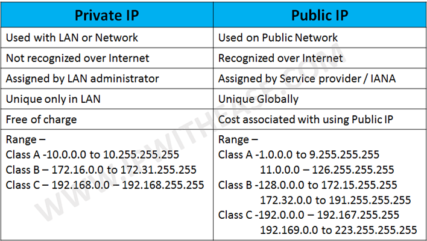
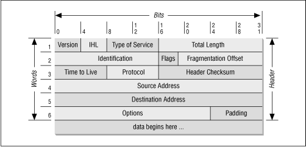
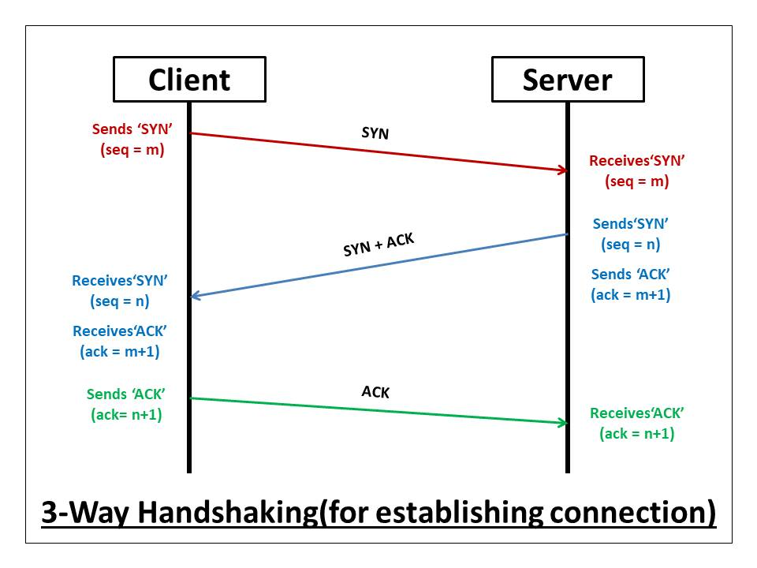
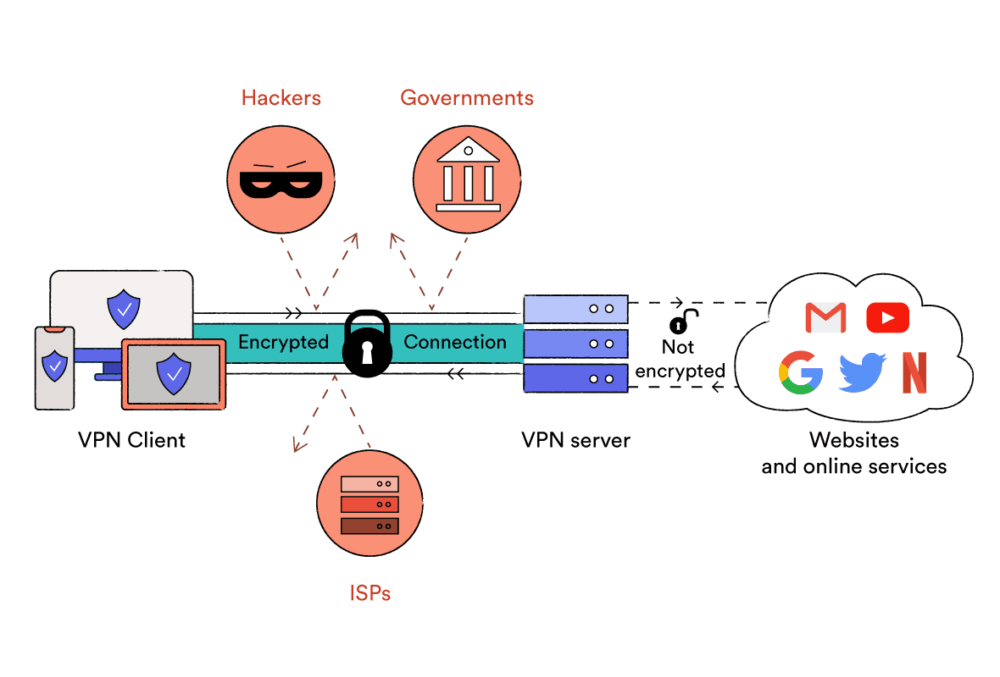
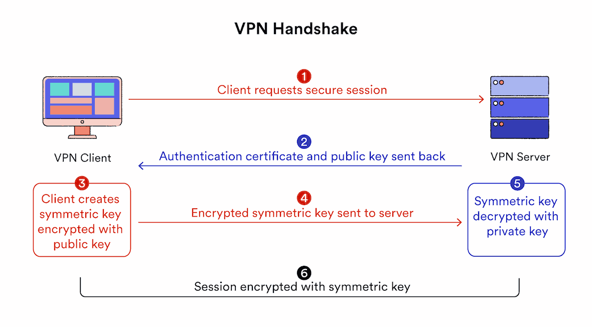
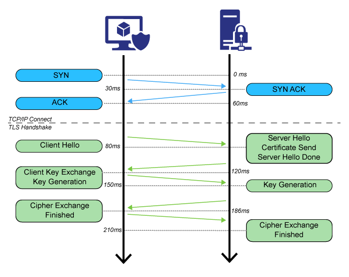

OSI Model Layers
* Application 7
* Presentation 6
* Session 5
* Transport 4
* Network 3
* Data Link 2
* Physical 1

Physical layer
* Transfer of bits in `0's` & `1's`
* Data format vary by medium: `Ethernets->ElectricPulse`, `Wifi->radioWaves`, `Fiber->LightPulse`
* Examples: `Ethernet Cable`, `Serial Cable`, `WiFI`, `Repeaters`, `Hubs`
* Repeater & Hub repeat singal from one to other medium. Hub is simply a multi-port repeater.

Data Link Layer
* Interface with physical layer that is responsible for putting 1s & 0s to/from wire.
* MAC an unique identifier as used as address, also called BIA(Burned in Adress).
* deliver packet from one NIC to another kind of `hop to hop`
* Examples: `Wifi NIC`, `Ethernet NIC`, `Switch`

Network Layer
* Responsible for packet delivery from `end to end`
* IP Address are used as address
* It is considered logical because IP is not parmanent unlike MAC.
* Examples: `Routers`, `HostWithNIC`

Transport Layer
* Once packet reaches computer, it help identify destination application/process i.e `service to service` delivery
* Port are used as address. It is of 2 Byte, hence 65,536 possible address on one IP device.
* Two method of stream: TCP & UDP. Both with possible 

IP Address
* IP are made of two part `network` & `host` identifier. i.e `0/24` means 24bits are used for network and remain 8bits for host.

TCP Packet

TCP handsake

Application Layer
* Data are handed over to application, software, service.
* On day to day basis, dev deal with this layer, involve in writting services.

Encapsulation vs Decapsulation
* As packet goes from one layer to other layer, different information are encapsulated at sender side and decapsulated at reciever side.
* Trasnport layer add TCP Headers with source and destination port address
* Network layer add IP header with source and destionation IP address
* DataLink layer add Ethernet layer with source and destination MAC address

Switch
* Maintain MAC address tables, that map its physical port to connected device's MAC address.
* Function: Learning, Flooding, Forwarding, and Filtering:
* This table is populated by looking at source mac address field of received frames.
* If for any frame, it does not know the destination MAC then it duplicate & flood  the frame at each port except receiving.

Router
* Router are used when packet has to be delivered to outside orginating network.
* It maintains routing table that contains paths to all the network knows how to reach.
* Each entry contains an IP network and either interface or IP of next router in path to target.
* It keep map of every network that exist. If not it discard the packet destined to such network.

Address Resolution Protocol

* packet delivery is always dataLink layer's work, hop to hop. So if one host want to send paket to other host, it must know destionation MAC as well.
* Host store the discovered MAC address in its ARP table. If it does know then it `broadcast` and ask "if there is someone out there with IP address, pls send your mac". ARP repsonse is sent as `Unicast`.
* If one host want send packet to other host in `same network` then it will use other host's Mac in destination
* If one host want to send to host in `other network` then it uses `default gateways` Mac as destionation

## VPN
* It provide secure(encrypted) way to access resource over public internet. It create private tunnel over internet.
* Cloud provider(aws, gcp) provide vpn as service, or on premise OpenVPN, CiscoVPN

Encryptions
* AES
* Blowfish

Protocols
* OpenVPN
* L2TP/IPsec

VPN Types
* Remote Access: used to access company private network securly over internet
* Personal : used to access interent securly over internet
* Mobie: same as remote but vpn keeps intact even if user changes network i.e from wifi to hotspot etc
* Site to Site: to join two private network

## SSL/TLS
* Secure socket layer and Transport layer security
* TLS version(1.1, 1.3 etc) & cipher negotiation
* Authenticate identity of server via its public key & SSL certificate authority's digital signature.
* Generate symetric session key to encrypt furthur data

## HTTPS
* HTTPS uses SSL 
