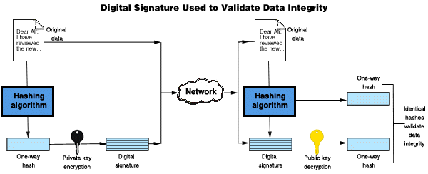

* confidential
* Integrity
* Authentication
* Anti-Replay

Encryption method
* symmetric
* asymetric
* hashing


##Hashing Algo
* Formulae that on being applied to given input produces an output. `input-->formulae=digest`
* It is used for integrity checks i.e message has not been changed or altered.
* Sender uses secret key along with msg to create hash digest then it sents msg & digest. Reciever recreate hash digest using secret key & message. If its matches then msg has not been altered and msg has been sent by right party that is having secret key.
* Algo should exihibit below characteristic for industry standared
    * Mathematcally almost impossible to extract original msg from digest. Also know as `one-way encryption`
    * Even a minor change in input should cause digest to change
    * Digest size should alwasy remain constant, it should not grow/srink as per size or input.
Digest Lengh
```
MD5     128Bits
SHA1    160Bits
SHA384  384Bits
SHA256  256Bits
```

```bash
echo "hello world" | md5sum
echo "hello world" | sha1sum
```

## Symetric encryption Algorithm
* Both party uses same secret key
* Big question is how to trasnfer key from one party to other, answer is `key exchange alog`
* Less CPU intensive, encrypted data size does not change, so good for large size of data.

encryption and key sizes
```
DES 56  56Bits
3DES    168Bits
AES     128Bits
AES192  192Bits
AES256  256Bits
```

## Asymetric encryption Algorithm
* Both party has its own two key, private & public
* Private key alwasy lies with sender while it share the public key reciever.
* Sender uses reciever's public key to encrypt data, reciever uses its own private key to decrypt data.
* High CPU intensive, encrypted data size increase, so good for small size of data. Used in symmetric key exchange, signature(hasing)
* Example:  `Diffie–Hellman key exchange`, `RSA`, `Digital Signature Standard(DSS)`

Authentication
* username & password
* pre shared keys
* digital certificate. SSL/TLS used in https
    * it contain public key of asymmetric key value pair and only one party can contain its associated private key.
    * browser uses it to verify if the authenticity of site. it encrypt random text with site's public key and send it to site server. server decrypt using its private key and send decrypted text back to browser. Browser compare returned text if its same then pass.

## Digital signature
* Digital signature used two alog, one is hashing algo and other is Asymetric encryption alog.
* Original data are hashed using hasing algo like SHA-256 to produce digest.
* Then digest are encrypted using its own private key to produce digital signature.
* Recpient verify two thing, one sign has not been tampered and other corresponding public key has been used.
* However, it does not verify the identity of signer, who he claims to be, impersonate, if public key truly belong to that identity. To solve this, we use digital certificate and Authentication.



## Digital Certificate
* A certificate is an electronic document that is used to identify an individual, a server, a company, or some other entity, and to associate that identity with a public key.
* Certificate authorities (CAs) are entities that validate identities and issue certificates.
* CA are mostly already trusted by client by pre-instaling known/famous CA on operating system.
* If client/server trust CA then it will also trust the certificate issue by CA to entity.
* Certificate also contain info like expiry date, issuer info, issuing info, public key, public key algo, signature, signature algo etc
* We can use self-sign certificate but this will not be recognised by any os or browser by default. So we will have to manually install this. It can be forged easly also. In some situation, it might not work because client will be distributed across globe, where we can't access sytem to store root CA.

## Authentication using Digital Certificate
* other authentication is password based, this is about certificate(key) based authentication.
* Three party involved incase of client-server based model: client(i.e browser), server(google.com), CA.
* when browser(as client) request google.com , request will go to some server and will be handled by that server.
* But before that client has to make sure that this server is really google.com server, not some other server impersonating on behalf of google.


## https vs TLS/SSL
* TLS is renamed to SSL. Both are more or less same. Initially they had difference but later on SSL deprecated.
* https(layer 7) uses tls(transport layer security) tcp layer4 security.
* see tls/ssl handsake for more detail. `TLS1.3` is latest one that has removed support of `RSA`, reduced time taken in handsake.
* In TLS handsake
    * client verify the server certificate using CA
    * clinet and server decide and generate session key(symmetric) that is used for encrypting data.
    * symmetric key is generated using client random, server random, premaster secret. Both arrive at same key.
